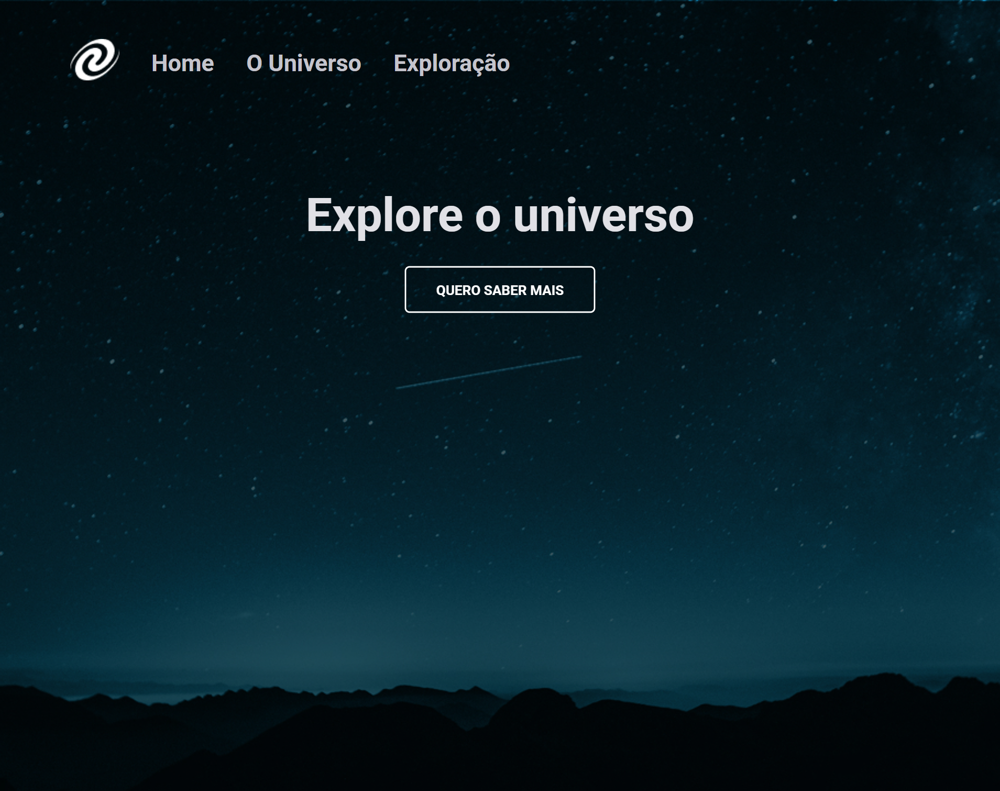

# SPA Universe

Projeto construído para fins de aprendizado  

  <a href="#-tecnologias">Tecnologias</a>&nbsp;&nbsp;&nbsp;|&nbsp;&nbsp;&nbsp;
    <a href="#-projeto">Projeto</a>&nbsp;&nbsp;&nbsp;

 

 

 

## 👾 Tecnologias

Esse projeto foi desenvolvido com as seguintes tecnologias:

- HTML, CSS e JS
- Git e Github
- Figma

## 🖼 Projeto

Esse site é basicamente em fins de aprendizado onde desenvolvi um sita em SPA - Single Page Aplication, onde consegui entender melhor e me aprofundar mais em JS.
